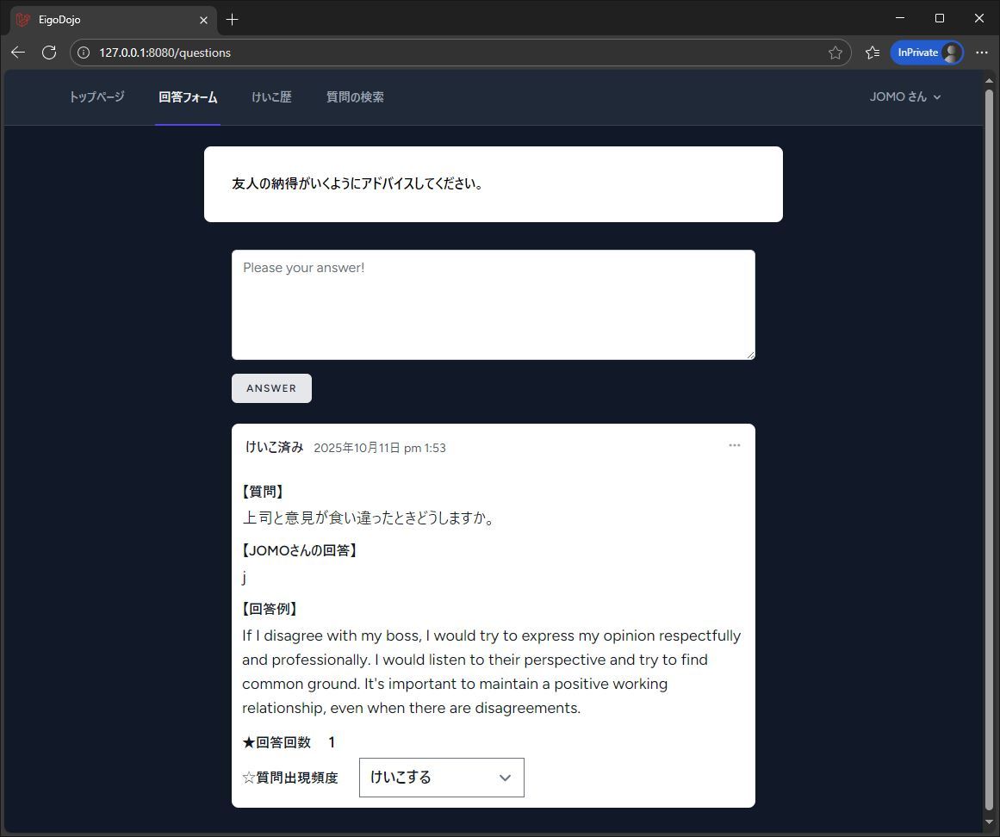
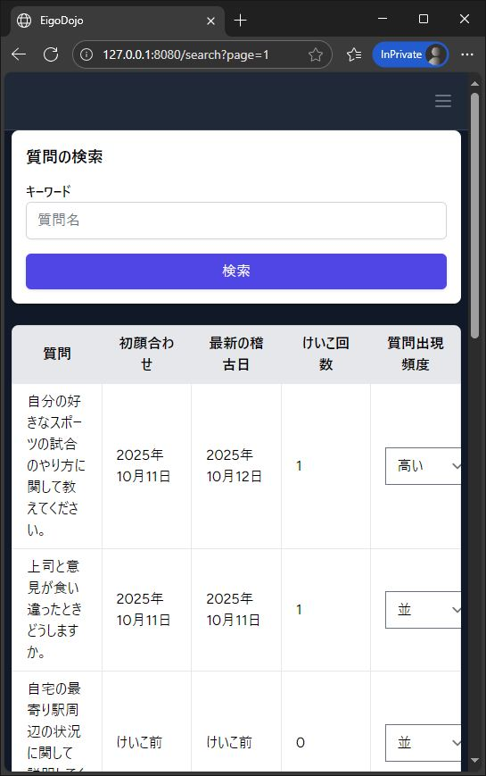

■ポートフォリオについて

・プロジェクト名  
英語作文道場（英語作文の問答をするWEBアプリ）

・使用技術  
Laravel (PHP, MySQL), JavaScript、AWS

・概要  
TSSTという電話での英語口答テストを参考にしてつくったアプリで、  
日本語の質問に対して回答を送ると、英語の例文、自分の作った文章、各質問の回答回数などが返ってくるアプリです。  
回答履歴の確認や、質問表示頻度(優先度)の調整なども可能です。生成AIもかなり活用しております。  
無料枠の範囲内ですが、AWSにデプロイしておりますので、よろしければ是非ご覧くださいませ。ログインする際は、下記のテスト用のIDとパスワードをご利用いただけましたら幸いです。  
※PHPunitなどの一部のファイルは、EC2内における容量削減のため削除しておりますが、ローカル環境でのテストは行っております。

【URL】  
※現在は公開を終了しております

【テスト用ID】  
test@example.com

【テスト用パスワード】  
password

・主な実装機能と技術的特徴  
ログインユーザーごとに回答履歴を表示。質問ごとの回答回数もカウント  
重みづけによって質問の出現頻度を変更できるように  
質問の検索機能とCRUD機能  

・主なページの機能  
①ウェルカムページ  
	ログインページや登録ページに移動できます。ログイン後はトップページに移動します。  
②回答フォームページ  
	ランダムに出力される質問への回答を行うページです。  
	回答すると、下部に最新の回答データやそれに付随する質問データ、回答例、回答回数、質問表示頻度が表示されます。質問表示頻度を変更することで質問の出現割合を調整できます。

 

③回答一覧ページ  
	ログインユーザーの回答履歴が確認できるページです。  
④検索ページ  
	質問をキーワード検索できるページです。質問ごとに本文、初めて回答した日時、最新の回答日時、回答回数、質問出現頻度をテーブルで整理しています。  
	質問本文以外の各項目の最上部をクリックするとソートできる仕様になっています。
 

・反省点  
①中間テーブルを分離すべきだった  
	コードのシンプル化、保守性の観点から、
	回答回数、質問表示頻度をそれぞれ分けて運用すべきでした。  
②データの取得方法  
	現状は質問データのソートなどをPHPで行っていますが、次回以降はデータベース側で完結させられる仕組みをしっかりと整えて、大量データへの対応力を高めたいです。  
③モデル名や役割が分かりにくかった  
	コードを足したり削ったりと試行錯誤をしながら取り組んだ結果、モデル名などが似通ったりと非常に分かりにくい構造となってしまいました。コードも重複した部分があります。  
	コントローラーに記載したコードをサービス化するなど、名称や役割の明確化やテストしやすい構造の導入をしっかり行いたいと思います。  
④もっと色々と作りたかった  
	ゲスト回答ページや管理ページもつくりたかったのですが、時間がなく今回は断念しました。また回答一覧も検索できるようにしたり、検索ページももう少し充実させたかったなと思っております。  

・課題と今後  
本プロジェクトは、しっかりと中間テーブルを生かせた点が良かったと思っておりますが、  
「こうしたいな」「これは直したいな」といった要素が残ったままでの公開となり、正直にいって悔しい気持ちの残るプロジェクトになりました。  
今後は今回の経験で得た反省点などを生かして、質が高くてより良いウェブサイトを素早く構築できるようになりたいと思っております。  
またデバッグの重要性を痛感した機会にもなり、PHPUnitなどを柔軟に使いこなせるように努めます。  
個人レベルでは、Githubや書籍で知識を蓄積しながら、ブログサイト等の構築や運用などを通して研鑽を積む方針です。  
